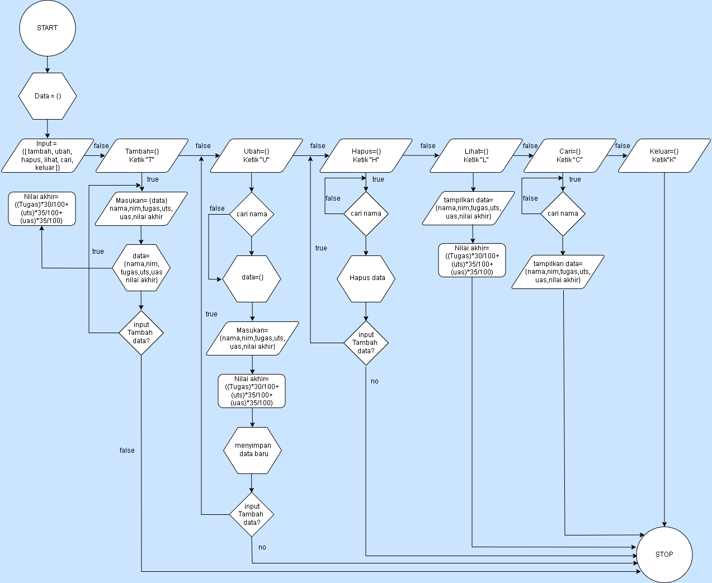
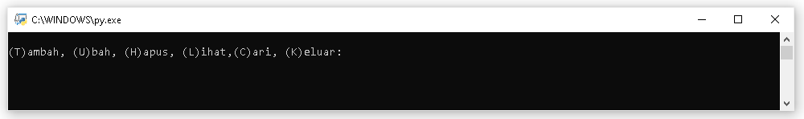
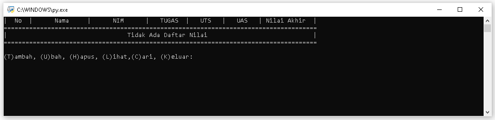
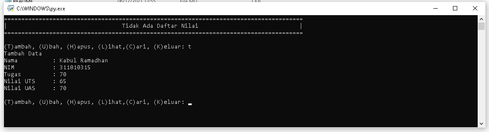
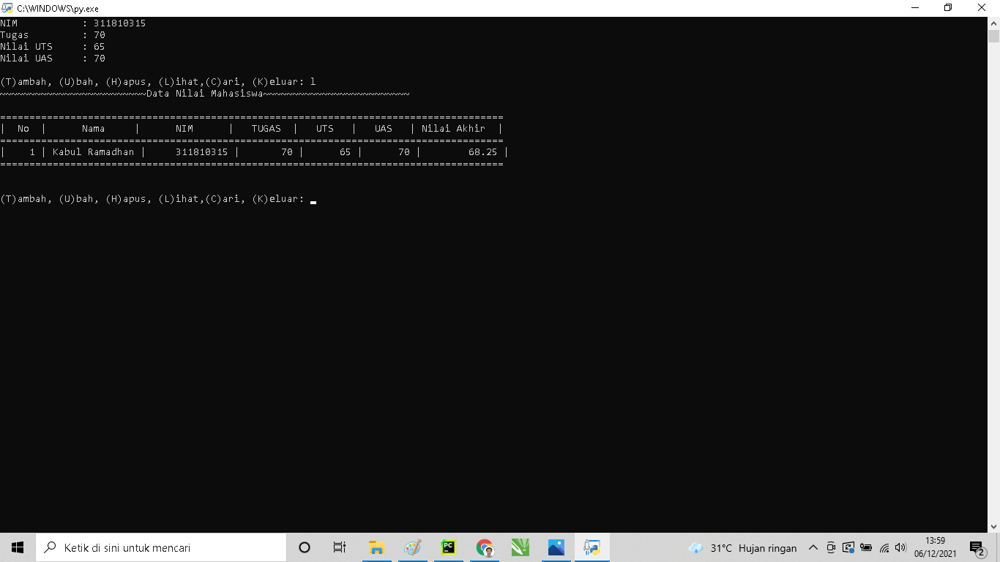

Kabul Ramadhan (311810315)
TI.18.B2 - Bahasa Pemrograman
---

##Tugas Pratikum 5
####Membuat Program Sederhana Menampilkan Daftar Nilai Mahasiswa
Dengan Ketentuan Sebagai Berikut :
* Program dibuat dengan dictionary
* menampilkan menu pilihan:
    * Tambah data
    * Ubah Data
    * Hapus Data
    * Cari Data
    * Tampilkan Data
* Nilai akhir dihitung dari 3 komponen perhitungan nilai (Tugas 30%, Uts 35%, Uas 35%)
* Buat flowchart dan penjelasan program pada README.md
* Commit and push repository ke github

#### --- FLOWCHART ---

#### --- PROGRAM ---

#### --- PENJELASAN ---
1. Sart
2. inputkan data={ } sesuai kenginan dengan format dictionary
3. Gunakan perulangan While True untuk menampilkan data sebanyak banyaknya
4. Masukan perintah g = input("(T)ambah, (U)bah, (H)apus, (L)ihat,(C)ari, (K)eluar: "),untuk mendapatkan perintah Tambah, Ubah, Hapus,Lihat,Cari,Keluar.
5. Menambahkan data menggunakan fungsi elif, lalu masukan nama, nim, tugas, uts, uas, nilaiakhir, nilai akhir didapat dari = ((tugas)*30/100+(uts)*35/100+(uas)*35/100)
6. jika ingin memilih  "lihat" gunakan fungsi 'elif' dan gunakan fungsi 'for x in data.items():' untuk memasukan data kedalam tabel data yang kita inputkan, dengan perintah "l". jika data yang tidak terdaftar = 0
7. Untuk menampilkan pilihan "hapus"gunakan fungsi 'elif' kemudian gunakan fungsi 'if nama in data.keys():' kemudian fungsi'del.data[nama] jika nama yang kita hapus tidak ada dalam tabel maka gunakan fungsi 'else' untuk menampilkan data tidak ada.
8. lalu untuk menampilan pilihan "cari"" gunakan fungsi 'elif' kemudian gunakan fungsi if nama in data.keys():' untuk mencari data nama kemudian gunakan fungsi 'else' untuk menampilkan data nama yang kita cari tidak ada.
9. lalu jika ingin keluar dari program  gunakan fungsi 'if' kemudian gunakan fungsi break untuk keluar dari data nilai/menghentikan program
10. Stop